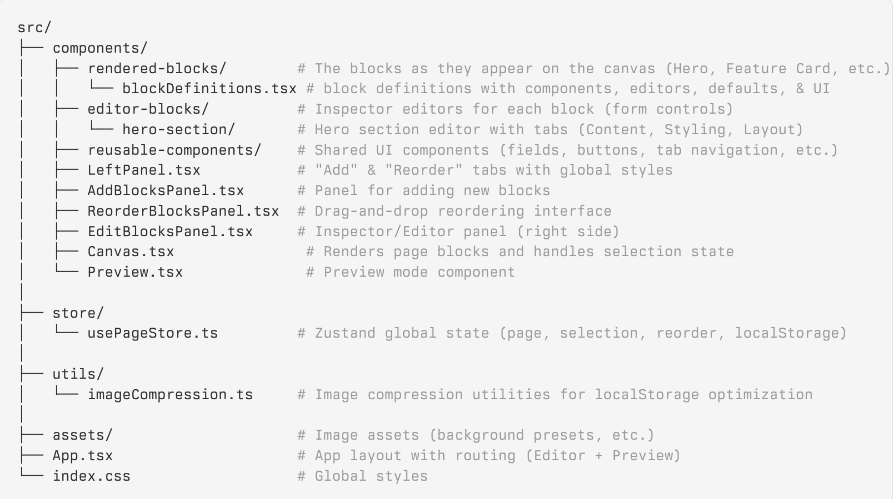

# Gradial Take-Home Assessment: 
A lightweight, React + Vite–powered webpage builder interface inspired by tools like Framer, Webflow, and Squarespace.
Users can add blocks, edit content, reorder sections via drag-and-drop, upload assets, and preview the composed page on canvas — all in a clean, modular, scalable architecture.

Hosted on Vercel: gradial-assessment.vercel.app
Product Demo & My Explanation: 

### Install dependencies
- npm install
- npm run dev
- npm run build (for production build)
- npm run preview (to preview production locally)

# Project Overall Structure:

## Features

### Block Library
Add modular blocks to build a page:
- **Navigation Bar** - Customizable logo and navigation links with section mapping
- **Hero Section** - Full-featured hero with background images, text styling, and layout controls
- **Feature Card** - Multi-feature cards (up to 3) with images, titles, descriptions, and links
- **Testimonial Section** - Customer testimonials with attribution
- **Footer** - Simple footer with customizable text
- (Easily extendable via `blockDefinitions.tsx`)

### Inspector Panel (Block Editing)
For each block type, users can edit:
- Titles, descriptions, and text content
- Images (via upload with automatic compression or preset assets)
- Layout inputs (padding, spacing, alignment, height)
- Navigation links with section mapping
- Multiple features per Feature Card block

Abstracted using reusable UI components:
- `<TextField />` - Text input fields
- `<TextAreaField />` - Multi-line text inputs
- `<FileUploadField />` - Image upload with compression
- `<ActionButton />` - Consistent action buttons (delete, save, preview, etc.)
- `<TabNavigation />` - Tabbed interfaces (used in Hero Section editor)

### Drag & Drop Reordering
Using `@dnd-kit`:
- Smooth vertical sorting  
- Intelligent keyboard + mouse support  
- Drag handles with visual feedback

### Canvas Rendering
- Shows a live preview of the built page
- Clicking selects a block
- Selected block is highlighted with ring border
- Scroll & layout isolated from the editor panels
- Global font styles applied to canvas content

### Preview Mode
- Full-page preview in separate route (`/preview`)
- Smooth scrolling navigation via navbar links
- Preserves all styling and layout
- Opens in new tab for easy comparison

### State Management & Persistence
- Zustand store for global state management
- Automatic localStorage persistence
- Cross-tab synchronization
- Image compression to optimize storage (handles up to 5MB images)

### Modular Architecture (Scalable)
- Separation between *rendered blocks* and *editor blocks*  
- Single source of truth: `blockDefinitions.tsx` centralizes all block metadata (components, editors, defaults, UI info)
- Zustand store for predictable, typed global state  
- Reusable UI primitives  
- Folder structure optimized for growth

## Adding a New Block

To add a new block type (all in one place!):
1. Create a rendered block component in `src/components/rendered-blocks/` (how it appears on canvas)
2. Create an editor component in `src/components/editor-blocks/` (form controls using reusable components like `TextField`, `ActionButton`)
3. Add one entry to `src/components/rendered-blocks/blockDefinitions.tsx` in the `BLOCK_DEFINITIONS` object with:
   - `id`: unique identifier
   - `name`: display name
   - `description`: tooltip/help text
   - `icon`: React icon component
   - `component`: the rendered block component
   - `editor`: the editor component
   - `defaultProps`: default property values

The block will :
- Appear in the "Add Blocks" panel
- Be available for editing in the Inspector
- Show up in the reorder panel
- Have default props when created

Reference existing blocks (e.g., `Footer.tsx` for simple, `HeroSection.tsx` for complex) as examples.